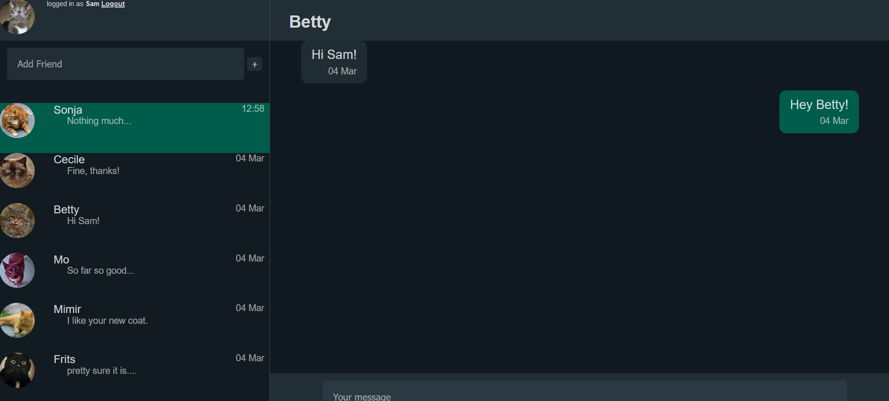

# Messenger

### Features
- Single page application
- User authentication
- Friends list
- New message alert
- Communication via WebSockets 

### Requirements
Django Channels
python -m pip install -U 'channels[daphne]'

### Tech
- Django back-end
- Javascript front-end
- Django Channels / WebSockets
- API calls

